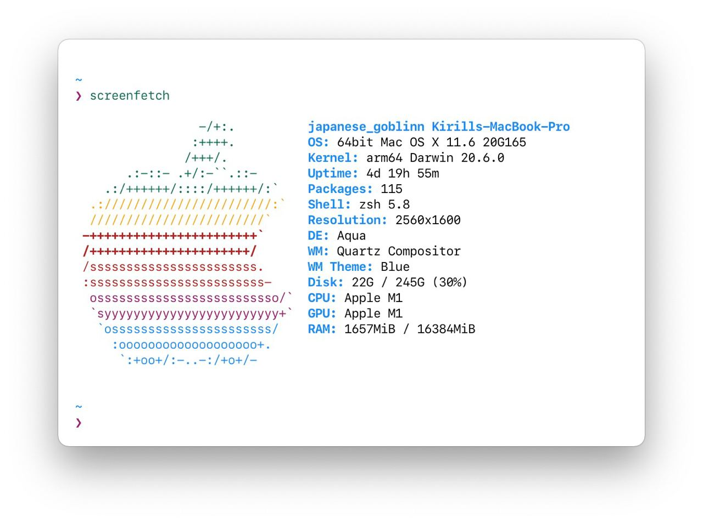
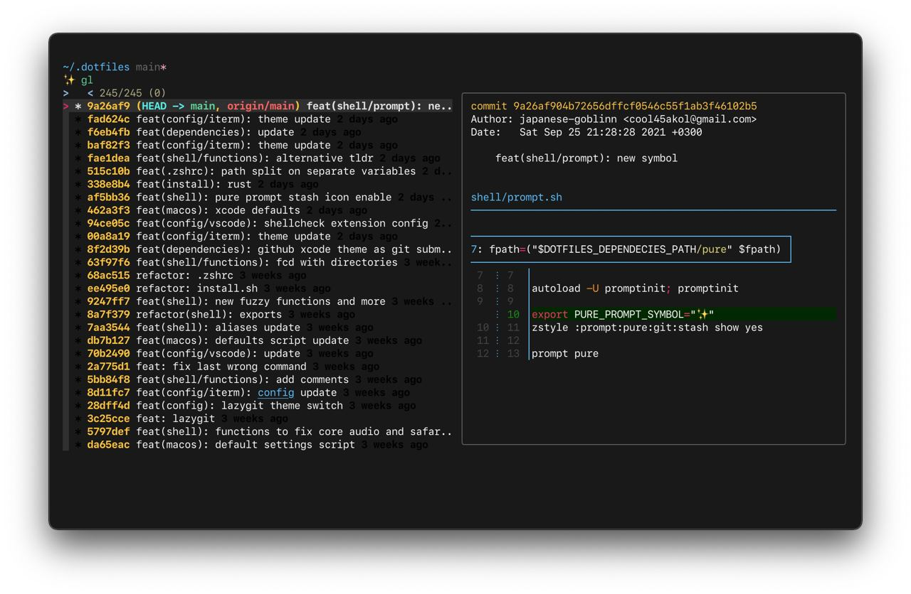

# .dotfiles

[](https://twitter.com/japanese_goblin) [](https://t.me/japanese_goblinn_mind)

Light Theme             |  Dark Theme
:-------------------------:|:-------------------------:
  |  

## Install

```shell
git clone "https://github.com/japanese-goblinn/.dotfiles.git" && cd ".dotfiles/" && make install
```
