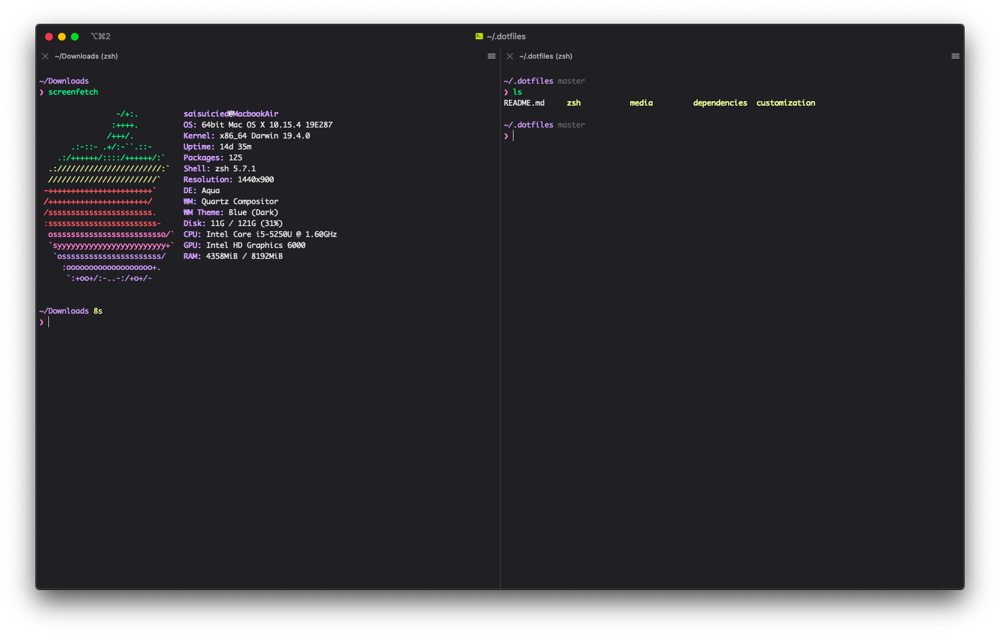
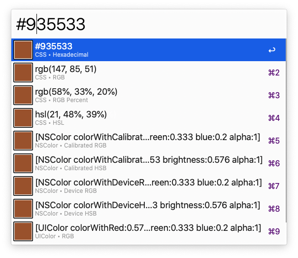
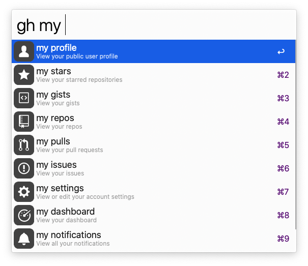
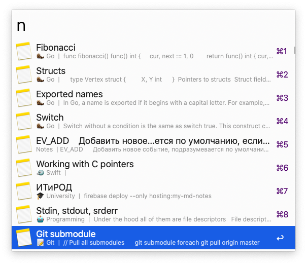
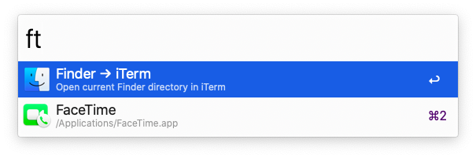

# Dotfiles++



This repository is my current `dotfiles` setup and some macOS essential tools.

* `zsh/`
  * `.aliases` - some useful shortcuts to do common stuff faster
  * `.zprofile` - some shell configurations
  * `.functions` - useful shell functions
  * `.zshrc` - loading of `.aliases`, `.zprofile`, `.functions` and all dependencies
* `dependencies/` - all zsh dependencies (like autocompletions or syntax highlighting)
* `customization/` - everything related to my my currently used terminal app [iTerm](https://www.iterm2.com)
* `alfred/` - [amazing](https://www.alfredapp.com) replacement for `Spotlight` with a lot of customizations to increase your productivity

## ToC

* Dotfiles
  * [Install](#install)
  * [Examples](#examples)
    * `.aliases`
    * `.functions`
* Alfred
  * [Workflows](#workflows)
* [Thanks](#thanks)

## About dotfiles

### Install

⚠️ **Important**

1. You should use `zsh`
2. Clone this repo into `~/.dotfiles`
3. Create link to `.zshrc` in `~/` with next command `ln -s ~/.dotfiles/zsh/.zshrc ~/.zshrc`
4. ✅

### Examples

Some examples. To learn more, please, look into files itself 😇

#### [`.aliases`](zsh/.aliases.zsh)

```bash
# Open GitHub repo for current direcroty
alias gho='open https://github.$(git config remote.origin.url | cut -f2 -d. | tr ':' /)'
```

#### [`.functions`](zsh/.functions.zsh)

```bash
# Creates directory and git repository from currently opened GitHub repo in Safari
ghi() {
    url=$(osascript -e 'tell application "Safari" to return URL of front document')
    if is_git_remote_url_reachable "$url"; then
        dir_name=${url##*/}
        cd ~/Downloads
        mkdir $dir_name
        cd $dir_name
        git init
        echo "# $dir_name" >> README.md
        git add README.md
        git commit -m "init ✨"
        git remote add origin $url
        git push -u origin master
    else
        echo -e "\e[31mBAD URL\e[0m"
    fi
}

# Move to trash instead of instant delete
t() {
    if [[ -n "$1" ]]; then
        mv $@ ~/.Trash
    else
        echo -e "\e[31m!ERROR!\e[0m At least one file/directory name should be passed"
    fi
}
```

## Alfred

### Workflows

* Colors - quick convert from any color format

  

* Emoji search - quick search some emoji

  

* Github - any github manipulation right from alfred search

  

* Google suggest - seach google with suggestions

  

* Search notes - workflow to search Apple Notes app

  

* Terminal finder - open current finder window in termial or vice versa

  

## Thanks

[Special thanks to @nikitavoloboev for inspiration](https://github.com/nikitavoloboev)
